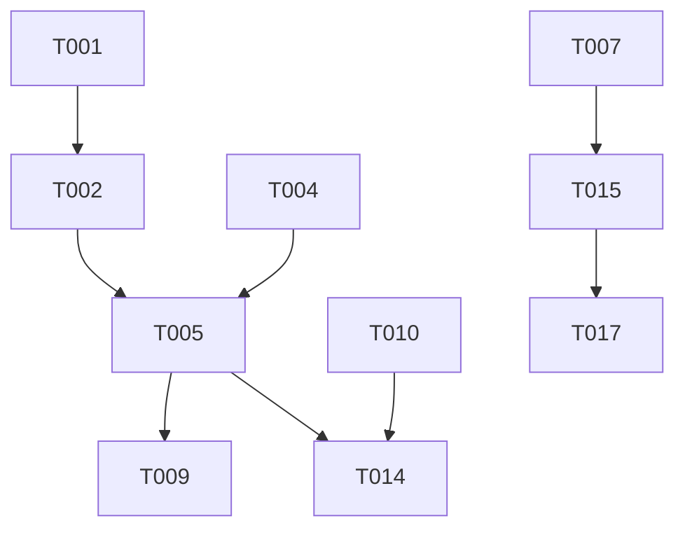

# Tasks: 《叫我大掌柜》经典五合一小游戏集

**Feature Branch**: `001-legend-multi-games`  
**Goal**: 构建五个核心玩法的 Demo 原型并集成在统一的主界面中。

## Phase 1: Setup (项目环境与资源脚手架)

- [x] T001 初始化小游戏所需的资源目录结构 `assets/resources/ui/` 和 `assets/script/`
- [x] T002 配置全局 UI 枚举并在 `assets/script/enums/UIEnum.ts` 中定义
- [x] T003 [P] 创建统一的游戏配置接口 `IGameConfig` 位于 `assets/script/config/GameConfig.ts`
- [x] T004 实现基础逻辑单例基类 `Singleton.ts` 位于 `assets/ace/logic/Singleton.ts`
- [x] T004-B 初始化并编译 `tools/prefabBuilder` 以确保 23 位 UUID 压缩支持

## Phase 2: Foundational (核心底层框架)

- [x] T005 实现游戏中心管理类 `GameCenter.ts` 负责面板切换逻辑 位于 `assets/script/logic/GameCenter.ts`
- [x] T006 实现本地存储管理器 `StorageControl.ts` 并遵循 Logger 参数规范 位于 `assets/script/logic/StorageControl.ts`
- [x] T007 配置 Cocos 2.3.x 物理引擎初始化脚本 位于 `assets/script/logic/PhysicsInit.ts`

## Phase 3: [US1] 游戏中心设计与主界面 (Priority: P1)

- [x] T008 [P] [US1] 定义 `UIHome.ts` 的 JSDoc 结构说明，由 `prefabBuilder` 自动解析
- [x] T009 [US1] 实现 `UIHome.ts` 中的按钮点击回调及面板加载逻辑 位于 `assets/script/ui/UIHome.ts`
- [x] T010 [US1] 使用 `prefabBuilder` 自动化构建包含 23 位 UUID 的 `UIHome.prefab`

## Phase 4: [US2] “一马当先”划线核心逻辑 (Priority: P1)

- [x] T011 [P] [US2] 定义 `UIGameHorse.ts` 的 JSDoc 结构说明，并手动配置 Graphics 节点
- [x] T012 [US2] 实现划线采样与 `cc.Graphics` 同步绘制逻辑 位于 `assets/script/game/horse/LineDrawer.ts`
- [x] T013 [US2] 实现马匹沿路径移动及障碍物碰撞判定逻辑 位于 `assets/script/game/horse/HorseLogic.ts`
- [x] T014 [US2] 使用 `prefabBuilder` 构建 `UIGameHorse.prefab` 并集成控制器逻辑

## Phase 5: [US3] “硕果累累”物理合成逻辑 (Priority: P1)

- [x] T015 [P] [US3] 定义 `UIGameFruit.ts` 的 JSDoc 并使用 `prefabBuilder` 生成预制体
- [x] T016 [US3] 实现基于 `DEFAULT_GAME_CONFIG` 的水果生成概率与物理参数
- [x] T017 [US3] 实现物理碰撞后的等级提升与合并动画逻辑（包含对象池 ObjectPool 实现） 位于 `assets/script/game/fruit/MergeSystem.ts`
- [x] T018 [US3] 实现顶部溢出判定线逻辑 位于 `assets/script/game/fruit/OverflowCheck.ts`

## Phase 6: [US5-7] 补充玩法：庄园拼图、大开眼界、水管接通 (Priority: P2)

- [x] T019 [P] [US5] 实现“庄园拼图”的托放吸附逻辑 位于 `assets/script/game/puzzle/PuzzleLogic.ts`
- [x] T020 [P] [US6] 实现“大开眼界”的差异点判定及缩放控制 位于 `assets/script/game/diff/DiffLogic.ts`
- [x] T021 [P] [US7] 实现“水管接通”的连通性 BFS 扫描算法 位于 `assets/script/game/pipe/ConnectionChecker.ts`

## Phase 7: [US4] 性能监控与质量闭环 (Priority: P2)

- [x] T022 [US4] 完善 `StorageControl.ts` 中的 LocalStorage 持久化快照逻辑
- [x] T023 实现 FPS 监控与首屏加载时长统计组件（对接 SC-001/SC-002）
- [x] T024 增加基础埋点存根记录玩家通关时长（对接 SC-003）

## Final Phase: Polish & Cross-Cutting Concerns

- [x] T025 优化各游戏面板间的 `cc.tween` 切换转场效果
- [x] T026 统一各游戏的返回按钮样式与确认弹窗逻辑 位于 `assets/resources/ui/CommonDialog.prefab`
- [x] T027 全量代码静态检测，确保无 `any` 且符合 Cocos 2.3.x 语法规范

---

## Dependency Graph

## Parallel Execution Examples

- **UI 并行**: T008 (Home UI), T011 (Horse UI), T015 (Fruit UI) 可同时进行。
- **逻辑并行**: T012 (划线算法), T016 (水果配置), T021 (连通性算法) 无相互依赖。

## Implementation Strategy

1. **MVP (Phase 1-4)**: 优先完成主界面与“一马当先”玩法。
2. **扩展阶段 (Phase 5-6)**: 逐个接入物理合成及其他益智类玩法。
3. **闭环阶段 (Phase 7-8)**: 集中处理数据持久化与全局性能优化。
