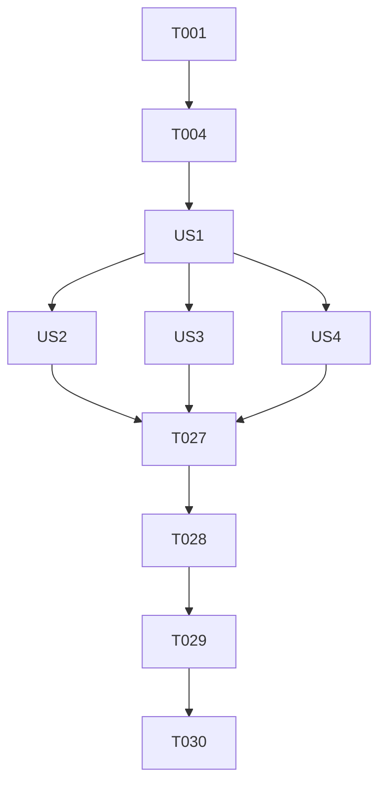

# 任务列表: 经典小游戏第二辑 (002-extra-mini-games)

**输入**: 来自 /specs/002-extra-mini-games/ 的设计文档
**前提条件**: plan.md, spec.md, research.md, data-model.md

## 格式说明: [ID] [P?] [Story] 描述

- **[P]**: 可并行执行 (文件修改间无前后依赖关系)
- **[Story]**: 关联用户故事 (US1, US2, US3, US4)
- 确保任务路径准确指向目标文件路径

---

## 第 1 阶段：项目初始化 (Setup)

**目标**: 补全基础设施枚举与单例脚本

- [X] T001 [P] 在 `assets/script/enums/UIEnum.ts` 中注册 6 款新游戏的 UI_ENUM
- [X] T002 验证 `tools/prefabBuilder` 的物理关节支持
- [X] T003 [P] 批量创建 6 款游戏的逻辑单例模板于 `assets/script/logic/`

---

## 第 2 阶段：基础支撑 (Foundational)

**目标**: 实现路由分发、日志与持久化

- [X] T004 在 `assets/script/logic/GameCenter.ts` 中实现 Prefab 路由跳转逻辑
- [X] T005 [P] 在 `assets/script/logic/StorageControl.ts` 定义各游戏最高分持久化 Key
- [X] T006 [P] 确保物理引擎全局初始化脚本 `assets/script/logic/PhysicsInit.ts` 正常生效

---

## 第 3 阶段：用户故事 1 - 核心入口逻辑 (Priority: P1)

**故事目标**: 用户能够顺利进入/退出 6 款小游戏

**独立测试点**: 从 UIHome 启动各游戏按钮，验证能否正确显示对应游戏面板，且返回后能回到主菜单。

- [X] T007 [US1] 在 `assets/script/ui/UIHome.ts` 中绑定 6 个新按钮并实现跳转回调

---

## 第 4 阶段：用户故事 2 - 垂直空间挑战 (Floor & Doodle) (Priority: P2)

**故事目标**: 实现垂直空间挑战的移动、生成与死亡判定

**独立测试点**: 
- 下一百层：角色站在移动平台，触碰顶部/底部尖刺分别触发失败。
- 涂鸦跳跃：角色向上跳跃时摄像机跟进，平台动态循环生成。

- [X] T008 [P] [US2] 实现垂直挑战核心算法单例 `assets/script/logic/FloorControl.ts` 与 `DoodleControl.ts`
- [X] T009 [P] [US2] 实现玩家与平台预制体脚本 `assets/script/prefab/PrefabGameFloorItem.ts` 与 `PrefabGameDoodlePlayer.ts`
- [X] T010 [US2] 补全下一百层面板逻辑 `assets/script/ui/UIPlayGroundGameFloor.ts` (带动态生成环)
- [X] T011 [US2] 补全涂鸦跳跃面板逻辑 `assets/script/ui/UIPlayGroundGameDoodle.ts` (带高度相机跟进)
- [X] T012 [US2] 使用工具生成 `assets/resources/prefabs/game/UIPlayGroundGameFloor.prefab`
- [X] T013 [US2] 使用工具生成 `assets/resources/prefabs/game/UIPlayGroundGameDoodle.prefab`

---

## 第 5 阶段：用户故事 3 - 益智消除挑战 (Poly, Bouncy, Bubble) (Priority: P2)

**故事目标**: 实现线段相交检测、物理反弹与同色消除算法

**独立测试点**: 
- 点线交织：拖拽圆环实时重绘线条并变色显示交叉点。
- 弹弹球：发射小圆球在挡板与砖块间物理反弹。
- 泡泡龙：发射器精准旋转射向目标，达成同色碰撞后消除。

- [X] T014 [P] [US3] 实现益智类算法逻辑 `assets/script/logic/PolyControl.ts`, `BouncyControl.ts`, `BubbleControl.ts`
- [X] T015 [P] [US3] 实现游戏物体预制体脚本 `assets/script/prefab/PrefabGamePolyBridge.ts`, `PrefabGameBouncyBall.ts`, `PrefabGameBubbleShot.ts`
- [X] T016 [US3] 补全点线交织交互逻辑 `assets/script/ui/UIPlayGroundGamePoly.ts`
- [X] T017 [US3] 补全弹弹球投掷与反弹逻辑 `assets/script/ui/UIPlayGroundGameBouncy.ts`
- [X] T018 [US3] 补全泡泡龙角度计算与射击逻辑 `assets/script/ui/UIPlayGroundGameBubble.ts`
- [X] T019 [US3] 生成点线交织预制体 `assets/resources/prefabs/game/UIPlayGroundGamePoly.prefab`
- [X] T020 [US3] 生成弹弹球预制体 `assets/resources/prefabs/game/UIPlayGroundGameBouncy.prefab`
- [X] T021 [US3] 生成泡泡龙预制体 `assets/resources/prefabs/game/UIPlayGroundGameBubble.prefab`

---

## 第 6 阶段：用户故事 4 - 抓娃娃物理互动 (Priority: P3)

**故事目标**: 实现物理引擎驱动的抓钩与娃娃抓取逻辑

**独立测试点**: 爪子能闭合、抓起物理奖品并运送。

- [X] T022 [P] [US4] 实现抓取控制逻辑单例 `assets/script/logic/ClawControl.ts`
- [X] T023 [P] [US4] 实现抓斗物理脚本 `assets/script/prefab/PrefabGameClaw.ts` (配置 HingeJoint)
- [X] T024 [US4] 补全抓娃娃全流程逻辑 `assets/script/ui/UIPlayGroundGameClaw.ts`
- [X] T025 [US4] 生成抓娃娃面板预制体 `assets/resources/prefabs/game/UIPlayGroundGameClaw.prefab`

---

## 第 7 阶段：性能验证与质量门禁 (Polish & Validation)

**目标**: 确保性能表现符合 SC-001/SC-002 标准及代码规范

- [X] T026 运行 `node tools/genMeta.js` 确保所有新增脚本的 meta UUID 稳定
- [X] T027 统一各小游戏的结算 UI 弹出逻辑与资源清理逻辑
- [X] T028 [SC-001] 性能验证：在 Chrome 控制台确认各游戏首屏加载时间 < 3s
- [X] T029 [SC-002] 物理压测：在基准机型真机上验证 FPS 稳定在 45 以上
- [X] T030 [P] 静态检查：验证所有新增脚本是否包含符合宪法 VIII 的 [Prefab 结构说明] JSDoc

---

## 依赖关系图

