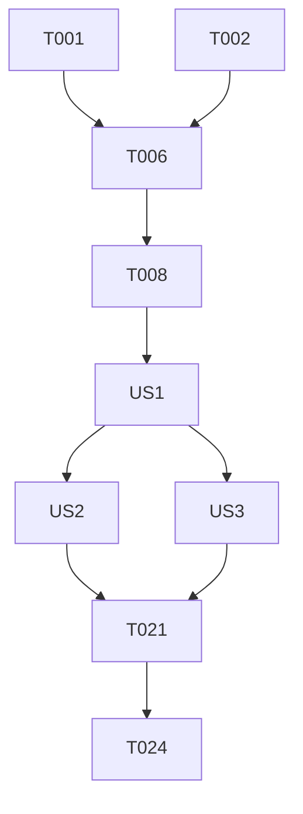

# 任务列表: 拆螺丝益智游戏 (Unscrew Puzzle)

**输入**: 来自 `/specs/004-unscrew-puzzle/` 的设计文档
**前提条件**: plan.md, spec.md, research.md, data-model.md

## 格式说明: `[ID] [P?] [Story] 描述`

- **[P]**: 可并行执行 (文件修改间无前后依赖关系)
- **[Story]**: 关联用户故事 (US1, US2, US3)
- 确保描述中包含准确的文件路径

---

## 第 1 阶段：项目初始化 (Setup)

**目标**: 基础枚举注册与脚本骨架创建

- [ ] T001 [P] 注册 `UNSCREW_PUZZLE` 游戏 ID 于 `assets/script/enums/UIEnum.ts`
- [ ] T002 [P] 创建单例控制器骨架 `assets/script/logic/UnscrewControl.ts`
- [ ] T003 [P] 创建螺丝预制体脚本 `assets/script/prefab/PrefabGameScrew.ts`
- [ ] T004 [P] 创建金属板预制体脚本 `assets/script/prefab/PrefabGamePlate.ts`
- [ ] T005 [P] 创建主界面 UI 脚本 `assets/script/ui/UIPlayGroundGameUnscrew.ts`

---

## 第 2 阶段：基础支撑 (Foundational)

**目标**: 物理引擎配置与核心约束逻辑实现

- [ ] T006 在 `assets/script/logic/UnscrewControl.ts` 中初始化物理引擎并设置重力环境
- [ ] T007 [P] 实现数据映射逻辑：解析 `data-model.md` 定义的 JSON 关卡结构
- [ ] T008 在 `assets/script/logic/UnscrewControl.ts` 实现 `cc.WeldJoint` 动态生成工具方法
- [ ] T009 [P] 创建物理容器层级预制体 `assets/resources/prefabs/game/UIPlayGroundGameUnscrew.prefab`

---

## 第 3 阶段：用户故事 1 - 基础拆卸与掉落机制 (Priority: P1) 🎯 MVP

**故事目标**: 用户点击螺丝后，螺丝移至备用位，且失去支撑的板受重力掉落

**独立测试点**: 手动在预制体中放置两个螺丝和一个板，连续点击两个螺丝后，板能够物理掉落出屏幕。

- [x] T010 [US1] 在 `assets/script/prefab/PrefabGameScrew.ts` 中实现点击交互与事件上报
- [x] T011 [US1] 实现 `assets/script/logic/UnscrewControl.ts` 中的 `tryUnscrew` 逻辑：断开 `WeldJoint`
- [x] T012 [P] [US1] 在 `assets/script/logic/UnscrewControl.ts` 实现螺丝移向备用槽位的 `cc.tween` 动画
- [x] T013 [US1] 在 `assets/script/prefab/PrefabGamePlate.ts` 中根据螺丝状态动态切换 `cc.RigidBody` 类型
- [x] T014 [US1] 实现 `assets/script/prefab/PrefabGamePlate.ts` 的销毁逻辑：超出屏幕底部时调用 `destroy`

---

## 第 4 阶段：用户故事 2 - 限位槽管理与失败判定 (Priority: P2)

**故事目标**: 引入槽位计数逻辑，处理操作死锁导致的失败

**独立测试点**: 连续拆卸螺丝填满所有槽位，第 4 个开始点击无效并触发抖动反馈，弹出结算失败界面。

- [x] T015 [US2] 在 `assets/script/logic/UnscrewControl.ts` 维护槽位数组 `(IScrewData | null)[]`
- [x] T016 [P] [US2] 在 `assets/script/ui/UIPlayGroundGameUnscrew.ts` 实现顶部槽位的状态刷新
- [x] T017 [US2] 实现失败检测：当 `slots` 数组全满且场景中仍有存活板时，触发失败流程
- [x] T018 [US2] 在 `assets/script/logic/UnscrewControl.ts` 实现快照存储逻辑：记录每步操作前的物理状态
- [x] T019 [US2] 实现 `undo` 指令：根据快照恢复螺丝位置与板的关节约束

---

## 第 5 阶段：用户故事 3 - 关卡进度与胜利奖励 (Priority: P3)

**故事目标**: 完成关卡闭环，支持结算、跳转及复活机制

**独立测试点**: 最后一个板掉落后，自动触发胜利结算，并能点击“下一关”加载新关卡。

- [x] T020 [US3] 实现场景板存量检测：所有具备目标标签的板销毁后触发胜利
- [x] T021 [P] [US3] 对接 `assets/script/ui/UISettlement.ts` 的显示与回调逻辑
- [x] T022 [US3] 实现“失败复活”逻辑：清理 2 个已占用的槽位，并支持动态增加 1 个临时空槽位
- [x] T023 [US3] 在 `assets/script/logic/UnscrewControl.ts` 中集成 `StorageControl` 保存关卡进度
- [x] T029 [US3] 实现关卡重置功能 (FR-009)

---

## 第 6 阶段：润色与质量校验 (Polish)

**目标**: 性能优化与规范化审计

- [x] T024 [P] 为所有新增脚本补全中文 JSDoc 并添加 `[Prefab 结构说明]`
- [x] T025 统一日志：将所有 `Logger` 标签规范为 "Unscrew"，并确保消息语言为中文
- [x] T026 物理压测：在 `assets/script/logic/UnscrewControl.ts` 中添加性能监控，确保 60 FPS
- [x] T027 运行 `node tools/genMeta.js` 更新所有新增脚本的资源 ID
- [x] T028 [US3] 遵循《宪法》原则 X: 在 `assets/script/ui/UIPlayGroundGameUnscrew.ts` 的 `onDestroy` 中显式执行 `UnscrewControl.destroyInstance()` 确保内存释放

---

## 依赖关系图

## 实现策略

1.  **MVP 优先**: 第 1-3 阶段完成后即具备核心玩法，可进行首轮 Demo 演示。
2.  **增量交付**: 通过 US1、US2、US3 的顺序，逐步建立游戏的策略性与系统完整性。
3.  **独立测试**: 每个用户故事阶段结束前，均需验证该阶段定义的“独立测试点”。
