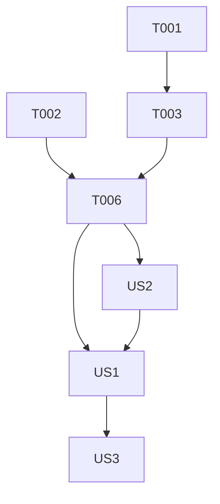

# 任务列表: 羊了个羊类三消游戏 (Sheep Match)

**输入**: 来自 `/specs/005-sheep-match/` 的设计文档
**前提条件**: plan.md, spec.md, data-model.md

## 格式说明: `[ID] [P?] [Story] 描述`

- **[P]**: 可并行执行 (文件修改间无前后依赖关系)
- **[Story]**: 关联用户故事 (US1, US2, US3)
- 确保描述中包含准确的文件路径

---

## 第 1 阶段：项目初始化 (Setup)

**目标**: 基础架构搭建与脚本创建

- [x] T001 [P] 注册 `SHEEP_MATCH` 游戏 ID 于 `assets/script/enums/UIEnum.ts`
- [x] T002 [P] 创建数据接口定义文件 `assets/script/logic/MatchDataTransfer.ts`
- [x] T003 [P] 创建单例控制器骨架 `assets/script/logic/SheepMatchControl.ts`
- [x] T004 [P] 创建方块预制体脚本 `assets/script/prefab/PrefabGameTile.ts`
- [x] T005 [P] 创建主界面 UI 脚本 `assets/script/ui/UIPlayGroundGameSheepMatch.ts`

---

## 第 2 阶段：基础支撑 (Foundational)

**目标**: 关卡加载与方块生成逻辑

- [x] T006 实现 `assets/script/logic/SheepMatchControl.ts` 中的关卡解析与方块实例生成逻辑
- [ ] T007 在 `assets/script/prefab/PrefabGameTile.ts` 实现基础视觉初始化 (根据 typeId 显示图标)
- [ ] T008 [P] 创建 UI 基础预制体 `assets/resources/ui/UIPlayGroundGameSheepMatch.prefab`
- [ ] T009 [P] 创建方块基础预制体 `assets/resources/prefabs/game/PrefabGameTile.prefab`

---

## 第 3 阶段：用户故事 1 - 核心消除机制 (Priority: P1)

**故事目标**: 方块进槽、排序并实现 3 连消除

- [x] T010 [US1] 在 `assets/script/prefab/PrefabGameTile.ts` 实现点击上报逻辑
- [x] T011 [US1] 在 `assets/script/logic/SheepMatchControl.ts` 实现槽位排序逻辑 (相同类型靠拢)
- [x] T012 [US1] 实现方块移动到槽位的 `cc.tween` 动画 (基于 UI 提供的槽位世界坐标)
- [x] T013 [US1] 实现在 `assets/script/logic/SheepMatchControl.ts` 中检测 3 连并销毁方块的消除算法

---

## 第 4 阶段：用户故事 2 - 堆叠遮挡系统 (Priority: P1)

**故事目标**: 处理多层覆盖关系，限制仅顶层（层级更高者）可点击

- [x] T014 [US2] 在 `assets/script/logic/SheepMatchControl.ts` 实现基于 `cc.Rect` 的遮挡检测算法
- [x] T015 [US2] 在 `assets/script/prefab/PrefabGameTile.ts` 根据遮挡状态展示置灰/禁点状态
- [x] T016 [US2] 实现联动机制：当上方方块被移走时，自动刷新下方受影响方块的可交互状态

---

## 第 5 阶段：用户故事 3 - 循环闭环与结算 (Priority: P1)

**故事目标**: 检测游戏胜负并对接结算界面

- [ ] T017 [US3] 实现胜利检测：场景内所有方块被清空时触发
- [ ] T018 [US3] 实现失败检测：当槽位满 (7个) 且无法进行下一步消除时触发
- [ ] T019 [P] [US3] 对接 `assets/script/ui/UISettlement.ts` 弹出结算弹板
- [ ] T020 [US3] 集成 `GameCenter` 支持从主页进入及返回
- [x] T025 [US4] 实现 `SheepMatchControl.ts` 中的撤销逻辑与命令栈管理 (原则 IX)
- [ ] T026 [US3] 集成 `StorageControl` 实现关卡进度的本地保存与读取 (原则 IX)

---

## 第 6 阶段：润色与交钥匙 (Polish)

**目标**: 性能优化与元数据同步

- [ ] T021 [P] 统一日志标签为 "Match" 并使用中文消息
- [ ] T022 [P] 补全所有脚本的 JSDoc 及 `[Prefab 结构说明]`
- [ ] T023 运行 `node tools/genMeta.js` 同步元数据
- [ ] T024 内存清理：在 `onDestroy` 中显式销毁 `SheepMatchControl` 实例

---

## 依赖关系图

## 实现策略

1. **MVP**: 优先完成 T001-T013 以确保基础三消逻辑跑通。
2. **逻辑前置**: 遮挡检测 (US2) 依赖于关卡初始化 (T006) 的层级数据。
