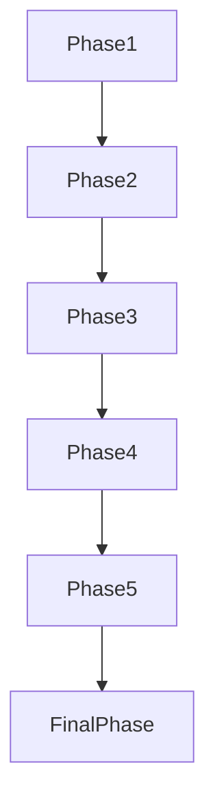

# Tasks: Merge Puzzle Game (合成类方格游戏)

**Feature Branch**: `006-merge-puzzle-game`
**Implementation Strategy**: MVP First (User Story 1), then incremental delivery of gravity and chain merges.

## Phase 1: Setup (Project Initialization)

- [x] T001 Define `IGameConfig` and `DEFAULT_GAME_CONFIG` in `assets/script/enums/MergeGameEnum.ts` (Constitution XIV)
- [x] T002 Create basic UI script `assets/script/ui/UIPlayGroundGameMerge.ts` with [Prefab 结构说明]
- [x] T003 Create square script `assets/script/prefab/PrefabMergeSquare.ts` with [Prefab 结构说明]
- [x] T004 Register `UI_ENUM.MERGE_GAME` in `assets/script/enums/UIEnum.ts`
- [x] T005 [P] Run `prefabBuilder` to generate `.prefab` files for UI and Square
- [x] T006 Implement `MergeGameLogic.ts` core data structures and initialization
- [x] T007 Implement BFS for connected squares detection
- [x] T008 Implement gravity refill logic in `MergeGameLogic.ts`
- [x] T009 [P] Implement `UIPlayGroundGameMerge.ts` to sync grid from logic
- [x] T010 Implement merge animation and automatic chain merge (Option C) with 300ms delay
- [x] T011 [Polish] Add score display and game over check
- [x] T012 Final validation of automatic chain merge logic
- [ ] T006b Implement unit tests for core logic in `MergeGameLogic.test.ts` (Constitution XI)
- [ ] T007 [P] Implement `PrefabMergeSquare.ts` with basic type display in `assets/script/prefab/PrefabMergeSquare.ts`

## Phase 3: User Story 1 - Core Merge Mechanic (Priority: P1)

**Goal**: Click a square to merge adjacent same-type squares and increment clicked square's type.

**Independent Test**: Create a grid with matching neighbors; clicking one results in an upgraded square at that position with neighbors removed.

- [ ] T008 [US1] Implement grid initialization algorithm (1-5 types) in `assets/script/game/MergeGameLogic.ts`
- [ ] T009 [US1] Implement `UIPlayGroundMergeGame.ts` with grid rendering using `Loader.getInstance().instantiate`
- [ ] T010 [US1] Implement click event handling and merge calculation in `UIPlayGroundMergeGame.ts`
- [ ] T011 [US1] Implement merge animation (moving neighbors to target) in `PrefabMergeSquare.ts` using `cc.tween`
- [ ] T012 [US1] Implement type upgrade logic and visual update in `PrefabMergeSquare.ts`

## Phase 4: User Story 2 - Gravity and Refill (Priority: P2)

**Goal**: Squares fall down to fill holes and new squares appear at the top. Supports chain merges with 300ms delay.

**Independent Test**: After merge, empty spaces are filled by falling squares and then by new ones from above.

- [ ] T013 [US2] Implement gravity calculation logic in `assets/script/game/MergeGameLogic.ts`
- [ ] T014 [US2] Implement downward falling animation in `PrefabMergeSquare.ts`
- [ ] T015 [US2] Implement top refill logic and entry animation in `UIPlayGroundMergeGame.ts`
- [ ] T016 [US2] Implement async game loop with 300ms delay for chain merges in `UIPlayGroundMergeGame.ts`

## Phase 5: User Story 3 - Game Progression and End State (Priority: P3)

**Goal**: Detect game over and high level progression.

**Independent Test**: Fill board with no moves and confirm "No more moves" notification. Reach level 10 and confirm notification.

- [ ] T017 [US3] Implement game over detection (no adjacent matches) in `assets/script/game/MergeGameLogic.ts`
- [ ] T018 [US3] Implement high-level type notification (e.g., reached Type 10) in `UIPlayGroundMergeGame.ts`
- [ ] T019 [US3] Add "New Game" and "Exit" functionality to UI in `assets/script/ui/UIPlayGroundMergeGame.ts`

## Final Phase: Polish & Cross-Cutting Concerns

- [ ] T020 Add `Logger.getInstance().info` calls for key game events (init, merge, game over)
- [ ] T021 Complete JSDoc comments for all public methods in `MergeGameLogic.ts` and `UIPlayGroundMergeGame.ts`
- [ ] T022 [P] Clean up unused properties in `assets/resources/prefabs/MergeSquare.prefab`

## Dependency Graph

## Parallel Execution Examples

- **UI & Logic Parallel**: `T005` (Logic structure) and `T007` (Prefab behavior) can be done in parallel.
- **Documentation & Refactoring**: `T021` (JSDoc) and `T022` (Prefab cleanup) can be done in parallel.
